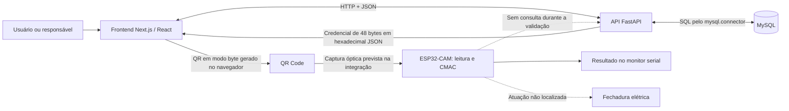
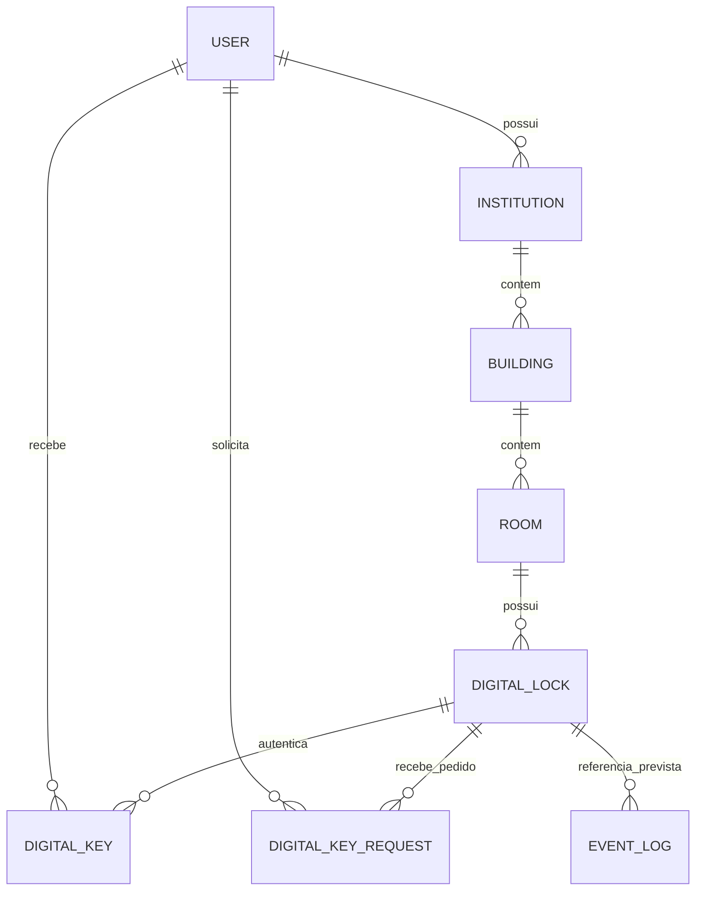

# FLIKE — arquitetura e estado do projeto

Documento de trabalho para orientar a redação do TCC e receber correções da equipe. Levantamento realizado em 30–31/08/2026, a partir do PDF, dos fontes LaTeX, dos diagramas e das versões locais dos repositórios. **Não é uma declaração de homologação, segurança ou conclusão do sistema.**

## 1. Como interpretar este levantamento

O projeto propõe controle de acesso físico com credenciais em QR Code, emissão centralizada e validação criptográfica local no ESP32-CAM. Há implementação de backend, aplicação web em Next.js/React e firmware de leitura/verificação de QR. Segundo confirmação recebida em 01/09/2026, o protótipo demonstrou de ponta a ponta a leitura e a decodificação do QR Code, a validação do comprimento, do identificador da tranca, de `issued_at`, de `expires_at` e do AES-CMAC, a emissão do sinal `HIGH`, o circuito de acionamento e a resposta da fechadura. Portanto, a integração física completa do FLIKE está demonstrada. As versões atualmente disponíveis no repositório não preservam todo o firmware usado no ensaio, e não há auditoria completa dos eventos físicos.

A aplicação React examinada está na referência local `origin/frontend_prototype`. Ela foi lida diretamente do Git, sem checkout. A equipe não indicou uma versão mais recente e confirmou que adotou uma abordagem de esforço reduzido na fase final. O backend correspondente está na referência local `origin/massive-vibe-code-session`, um commit à frente do checkout aberto; esse commit final foi igualmente lido diretamente do Git, sem modificar o repositório. O firmware possui mudanças locais ainda não commitadas cuja origem a equipe não reconhece; elas não devem ser tratadas como refatoração ativa. Portanto, “o código do projeto” não corresponde simplesmente às quatro branches `main` nem apenas aos arquivos atualmente abertos nos checkouts.

As afirmações usam estas categorias:

- **Implementado no código:** existe lógica concreta nos arquivos examinados. Não significa execução bem-sucedida em ambiente real.
- **Parcial:** há componentes, mas faltam integração, controles ou evidência de funcionamento completo.
- **Previsto:** aparece na tese, nos diagramas ou em documentação de intenção, sem implementação correspondente localizada.
- **Demonstrado historicamente:** aparece em relatório, fotografia ou vídeo de uma etapa anterior; não implica que o checkout final reproduza o mesmo fluxo.
- **Não confirmado:** depende de montagem física, ambiente, versões não disponíveis, decisões da equipe ou ensaios não registrados.
- **Divergência:** duas fontes disponíveis descrevem comportamentos diferentes.

Não foram alterados frontend, backend ou firmware; não foram executados scripts de banco, servidores, deploys, instalação de dependências, gravação de placa ou atualização de referências remotas. Não foram consultados dados reais de usuários nem arquivos de credenciais. O levantamento não confirma o estado atual do GitHub: `origin/...` designa a referência já existente localmente.

### 1.1 Versões examinadas

| Repositório / fonte | Referência | Commit / estado |
| --- | --- | --- |
| Backend principal desta análise | `origin/massive-vibe-code-session` | `e9268ccfcbd94e16deb4f0eb641c18b5195b63b9`, commit de 20/08/2026; o checkout local está no pai `6f9efd4...` |
| Backend anterior, consultado para comparação | `main` / referência `origin/main` | `ae703ad4b4af9ac207f523df63cf87510899239b` na referência remota local; API mais antiga |
| Frontend Next.js, principal desta análise | `origin/frontend_prototype` | `9005601719e98b5cac1c3586d07ef79b06a28a00`, 20/08/2026 |
| Firmware | `main` + arquivos locais | `c2983f4ce6e02fd4ce68c212a54e8c5fd6ef1e78`, 09/03/2026, com mudanças descritas abaixo |
| TCC | `main` + alterações editoriais locais | `56fc452b41bef8750e7a6152d16df8d523eec069`, 01/09/2026, antes da conclusão local do Capítulo 4 |
| PDF recebido | arquivo local ainda não rastreado | `pdfs/FLIKE-referencia-2026-08-30.pdf`, 45 páginas; metadados de criação em 30/08/2026, 22:35:27, UTC−03 |
| Antecedente histórico do Laboratório de Processadores | pacote Overleaf em `materiais/CAUSP_LOCK/` | fonte da origem do projeto e da base elétrica reaproveitada; não representa uma versão do FLIKE |

Alterações já existentes antes deste trabalho: backend `scripts/run_server.sh` modificado; firmware `src/digital_key.cpp` e `src/digital_key.h` modificados, além de `sdkconfig.defaults`, `src/digital_lock.cpp` e `src/digital_lock.h` não rastreados. O PDF também já estava não rastreado. Esses arquivos foram preservados.

### 1.2 Convenção de evidências

Nas referências abaixo, **B** significa backend na versão principal acima; **F** significa frontend no commit Next.js; **W** significa firmware com as mudanças locais; **T** significa TCC; **H** significa material histórico do Laboratório de Processadores e fontes oficiais associadas. A seção 15 relaciona caminhos e símbolos para localizar cada evidência. Para B e F, as consultas reproduzíveis são, respectivamente, `git show e9268ccfcbd94e16deb4f0eb641c18b5195b63b9:caminho/do/arquivo` e `git show 9005601719e98b5cac1c3586d07ef79b06a28a00:caminho/do/arquivo`, executadas nos repositórios correspondentes.

## 2. Problema, contexto e fronteira do sistema

A tese tem o título **“Desenvolvimento e implementação de um sistema de controle de acesso a espaços públicos acessível a neurodivergentes”**. Os autores são Hélcio Prado de Lima, Henrique Eduardo dos Santos de Souza e Mateus Kosicov Perugini; o orientador é o Prof. Dr. Reginaldo Arakaki, no Departamento de Engenharia de Computação e Sistemas Digitais da Escola Politécnica da USP. [T01]

O cenário descrito é a sala de apoio à amamentação e regulação sensorial da Faculdade de Direito da USP, no prédio histórico do Largo de São Francisco. O problema apresentado é a dependência de retirada manual de chaves com funcionários, associada a constrangimento, barreiras sociais e cognitivas, subutilização e dificuldades de controle. Isso é o **contexto relatado pela equipe na tese**, não resultado de pesquisa de campo realizada neste levantamento. [T01, cap. 1]

A notícia oficial da FDUSP confirma a inauguração da sala em abril de 2024, sua localização no terceiro andar do Prédio Histórico e sua finalidade de apoio à amamentação e regulação sensorial. Ela não confirma as dificuldades de liberação de chave, que permanecem sustentadas pela experiência de um autor, por reunião institucional e por relatos informais de colegas. [H08]

O objetivo é proporcionar autonomia a usuários autorizados e reduzir interações obrigatórias para entrar no espaço, mantendo controle e rastreabilidade. A aprovação administrativa continua existindo no fluxo implementado; a proposta não elimina toda intervenção humana na concessão de acesso. O cadastro não comprova por si só vínculo com a USP nem pertencimento ao público-alvo.

**Nomenclatura:** o nome oficial e único do projeto é **FLIKE**. O nome foi escolhido em homenagem ao gato de infância de um dos autores; não é uma sigla. Denominações anteriores foram descontinuadas e só poderão aparecer em uma referência histórica breve sobre a origem do trabalho; a descrição técnica, os diagramas, a interface e a documentação do produto usarão FLIKE.

Embora o caso de uso seja uma sala específica, o modelo implementado suporta múltiplas instituições, prédios, salas e fechaduras. Isso é capacidade estrutural do modelo, não evidência de implantação em vários locais.

### 2.1 Atores e conceitos

| Conceito | Significado no projeto |
| --- | --- |
| Usuário | Pessoa cadastrada, identificada por `user.id`, nome e e-mail |
| Responsável / administrador | Usuário que é `owner_id` de uma instituição; seus poderes decorrem dessa propriedade |
| Instituição | Agrupamento de prédios administrado por um usuário |
| Prédio | Unidade com endereço vinculada a uma instituição |
| Sala | Espaço físico, com nome e número, vinculado a um prédio |
| Tranca física | Conjunto embarcado, câmera, interface e mecanismo elétrico proposto |
| Tranca elétrica | Atuador que efetivamente impede ou permite a abertura |
| Tranca digital | Registro `digital_lock`, associado a uma sala e a um segredo criptográfico |
| Chave digital de acesso | Credencial binária emitida para um usuário e uma tranca digital |
| Chave secreta criptográfica | Segredo simétrico de 32 bytes usado para gerar e verificar o CMAC; não é a credencial entregue ao usuário |
| Solicitação | Pedido de uma chave, com estado `pending`, `approved` ou `rejected` |

O banco não tem classes/tabelas separadas de cliente e administrador nem campo de papel em `user`. Isso corresponde à decisão do produto: todo usuário pode administrar as instituições que possui e atuar como cliente nas instituições de outros usuários. O papel é contextual, derivado da propriedade de `institution`, e não uma característica global da conta. Não existe superadministrador global nem suporte atual a vários administradores para a mesma instituição. [B02, B03, B04]

## 3. Visão arquitetural

### 3.1 Componentes e responsabilidades

| Componente | Responsabilidade encontrada | Limites da evidência |
| --- | --- | --- |
| Frontend Next.js/React | Cadastro/login, navegação, solicitações, administração, consultas e renderização do QR | Há divergências semânticas e páginas incompletas; os contratos de solicitações combinam com o último commit do backend |
| API FastAPI | Identidade, recursos físicos lógicos, propriedade administrativa, emissão de credenciais e registro de uso no banco | Nem todas as rotas exigem autenticação; não há integração embarcada localizada |
| MySQL | Persistência relacional de contas, infraestrutura, segredos, chaves e solicitações | DDL examinado; banco em execução não inspecionado |
| Firmware Arduino/C++ | Aquisição de QR e cálculo/comparação de AES-CMAC via mbedTLS | Validador parcial; árvore local tem incompatibilidade de chamada |
| ESP32-CAM / câmera | Plataforma alvo e aquisição óptica | Modelo AI-Thinker no código; OV2640 declarada na tese; montagem não inspecionada |
| Fechadura elétrica / energia / HMI | Abertura física, continuidade elétrica e feedback pretendidos | Circuito simples confirmado pela equipe; esquema e lógica completa de atuação ainda não documentados |

As ligações com API e banco são implementadas nos fontes. O diagrama não afirma que a combinação dessas versões executou de ponta a ponta. O percurso óptico tem emissor e leitor implementados separadamente, mas não foi ensaiado neste levantamento. [B01–B08, F01–F08, W01–W03]

### 3.2 O que “offline” significa aqui

A proposta permite que o dispositivo confira uma credencial sem consultar o servidor no instante da leitura, desde que já possua o segredo correto. A função de CMAC do firmware não usa rede.

“Offline” qualifica principalmente o firmware: a tranca deve decidir localmente se abre, sem consultar o servidor a cada leitura. Isso ainda exige checagem temporal e acionamento físico, ambos incompletos no firmware disponível. A emissão, a solicitação, a gestão e a obtenção inicial da imagem exigem internet e acesso ao frontend.

Depois de obtido, o QR deve permanecer disponível ao cliente por pelo menos uma das formas prometidas pelo projeto: download para o celular ou disponibilidade contínua na página de chaves digitais. Um aplicativo móvel seria apenas uma alternativa hipotética de apresentação; ele não será desenvolvido. Download e persistência após recarga ainda não estão implementados nos fontes examinados.

O custo deliberadamente aceito da validação offline é não conseguir revogar de forma confiável uma credencial já emitida antes do término de sua validade. O projeto trabalha com concessão de permissões e não implementará revogação. A tranca deve possuir horário confiável para limitar a janela autorizada. O segredo e a identidade da tranca são definidos pelo fornecedor durante a programação do ESP32-CAM; configuração em campo, troca de segredo e provisionamento remoto estão fora do escopo.

## 4. Backend

### 4.1 Organização e tecnologias

O backend é uma aplicação FastAPI com routers por domínio. Os endpoints chamam repositórios em `app/database/repositories.py`, que executam SQL diretamente por `mysql.connector`. Os modelos Pydantic descrevem entradas e algumas respostas. Os módulos de autenticação, CMAC e conversão binária são utilizados pelas rotas e repositórios. Não há ORM encontrado nem uma camada ampla de serviços intermediando os casos de uso: `app/services/env.py` concentra configuração de ambiente. [B01–B09]

`docs/project_structure.md` contém exemplos genéricos de predição/ML e uma estrutura idealizada; não descreve fielmente os módulos efetivos. Não há razão para apresentar aprendizado de máquina como parte deste projeto.

Versões declaradas em `requirements.txt`: FastAPI `0.133.1`, Pydantic `2.12.5`, Uvicorn `0.41.0`, `mysql-connector-python` `9.7.0`, `cryptography` `46.0.5`, PyJWT `2.13.0` e `python-dotenv` `1.2.1`. `segno` `1.6.6` está declarado, mas não foi localizado uso na aplicação ativa para renderizar QR. Dependência listada não é prova de funcionalidade utilizada.

### 4.2 Configuração e banco

As variáveis esperadas são `DB_HOST`, `DB_USER`, `DB_PASSWORD`, `DB_DATABASE`, `DB_PORT` e `JWT_SECRET`; são lidas por `python-dotenv`/`os.getenv`. O pool MySQL é global, criado na importação, com 16 conexões e `pool_reset_session=True`. A classe `Database` obtém conexão do pool e cursor com resultados em dicionários. [B09]

A dependência `get_database()` fornece a conexão por requisição, executa rollback em exceções e fecha cursor/conexão ao final. Os repositórios realizam commits explícitos. Isso dá transações a operações individuais, mas não garante atomicidade de um caso de uso que invoque vários métodos com commits separados.

O script local `scripts/run_server.sh` inicia Uvicorn em `0.0.0.0:8000` com `--reload`. É configuração de desenvolvimento, não evidência de implantação de produção. CORS admite `http://localhost:3000` e `http://127.0.0.1:3000`, permite credenciais e todos os métodos/headers. Não foram encontrados configuração de TLS, proxy reverso, domínio, containers ou infraestrutura de nuvem nos arquivos examinados. [B01, B09]

### 4.3 Identidade e sessão

1. `POST /user/new` cadastra nome/e-mail e cria credenciais.
2. `user` armazena e-mail legível; `auth` armazena SHA-256 do e-mail, salt e SHA-256 de `salt + password`.
3. O salt é gerado com `secrets.token_hex(16)`, isto é, 16 bytes aleatórios representados por 32 caracteres hexadecimais.
4. `POST /auth/user` verifica as credenciais e retorna JSON com campo **`token`**.
5. O JWT usa HS256, contém `user_id` e expira em uma hora. O segredo de JWT é configuração distinta do segredo AES de cada tranca.
6. As rotas protegidas recebem `Authorization: Bearer ...`; `verify_token()` verifica assinatura e expiração.
7. Perfil próprio pode ser consultado/alterado, e a troca de senha exige a senha atual. A mudança de e-mail atualiza o hash correspondente em `auth`.

Não foram localizados login federado USP, verificação de e-mail, restrição efetiva a `@usp.br`, autenticação multifator, recuperação de senha, refresh token ou revogação de sessões. O uso de SHA-256 com salt é o comportamento observado; não equivale a um esquema de derivação de senha com custo adaptativo. A troca de senha reutiliza o salt e não invalida explicitamente JWTs emitidos. [B06]

### 4.4 Autorização administrativa

O router `/admin` exige token. Para operações nos recursos, o backend percorre a hierarquia até `institution.owner_id` e o compara com `user_id` do token. As listagens administrativas retornam recursos das instituições do usuário. Ao mover prédio, sala ou tranca, também verifica a propriedade do destino. Exclusões impedidas por referências no banco são traduzidas em conflito HTTP 409. [B03, B04]

Qualquer usuário autenticado pode criar uma instituição e tornar-se seu responsável. Não existe verificação adicional de uma função global de administrador no código examinado. O menu da interface também apresenta entradas administrativas sem derivar um papel global. Isso pode ser uma decisão do modelo de produto, mas não deve ser descrito como cadastro institucional previamente homologado.

Essa proteção não cobre toda a API: continuam registradas rotas públicas de criação de trancas e emissão direta de chaves. Portanto, a política de propriedade implementada em `/admin` não constitui, por si só, uma barreira completa de autorização. A seção 11 detalha a consequência.

### 4.5 Inventário de endpoints registrados

“Público” significa que não foi encontrada dependência de autenticação na rota nem globalmente em `app/main.py`; não afirma como um eventual proxy externo estaria configurado.

| Método e caminho | Função | Controle no código |
| --- | --- | --- |
| `POST /` | Resposta de saudação para verificação básica | Público; não testa banco/câmera |
| `POST /auth/user` | Login | Credenciais no corpo |
| `POST /auth/token` | Validação de JWT fornecido no parâmetro `jwt_token` | Público |
| `GET /auth/request` | Demonstração de rota protegida | Bearer |
| `POST /user/new` | Cadastro | Público |
| `GET /user/all`, `GET /user?id=...` | Listagem e consulta de usuários | Público |
| `GET /user/me`, `PUT /user/me` | Perfil próprio | Bearer |
| `POST /user/change-password` | Troca de senha | Bearer + senha atual |
| `GET /institution/all`, `/building/all`, `/room/all` | Catálogo global | Público |
| `GET /institutions/search?q=...` | Busca textual de instituições | Público |
| `GET /buildings/search?q=...&institution_id=...` | Busca de prédios, filtro institucional opcional | Público |
| `GET /rooms/search?q=...&building_id=...` | Busca por nome/número de sala, filtro de prédio opcional | Público |
| `GET /digital_lock/all`, `GET /digital_lock?room_id=...` | Consulta de trancas, incluindo segredo serializado | Público |
| `POST /digital_lock/new` | Cria tranca e segredo | Público |
| `GET /digital_key/all` | Lista credenciais | Público |
| `GET /digital_key?id=...` | Lista credenciais do usuário informado | Público; `id` é ID do usuário |
| `GET /digital_key?key_id=...` | Recupera uma credencial | Público; `key_id` tem precedência se ambos presentes |
| `POST /digital_key/new` | Emissão direta com usuário, tranca e expiração | Público |
| `POST /digital_key/use` | Confere payload e marca uso no banco | Público |
| `GET /digital_key/requests` | Lista solicitações do usuário autenticado, com filtro opcional `status` | Bearer; usuário obtido do token |
| `POST /digital_key/request` | Solicita chave para `lock_id` | Bearer; usuário obtido do token |
| `GET`, `POST /admin/institutions` | Lista instituições próprias / cria instituição | Bearer |
| `PUT`, `DELETE /admin/institutions/{id}` | Edita/exclui instituição | Bearer + proprietário |
| `GET`, `POST /admin/buildings` | Lista/cria prédios | Bearer + escopo/propriedade |
| `PUT`, `DELETE /admin/buildings/{id}` | Edita/exclui prédio | Bearer + proprietário |
| `GET`, `POST /admin/rooms` | Lista/cria salas | Bearer + escopo/propriedade |
| `PUT`, `DELETE /admin/rooms/{id}` | Edita/exclui sala | Bearer + proprietário |
| `GET`, `POST /admin/locks` | Lista/cria trancas | Bearer + escopo/propriedade |
| `PUT`, `DELETE /admin/locks/{id}` | Edita/exclui tranca | Bearer + proprietário |
| `GET /admin/rooms/{id}/key-holders` | Portadores de chaves da sala | Bearer + proprietário |
| `GET /admin/key-holders` | Portadores de chaves das instituições próprias | Bearer + escopo |
| `GET /admin/key-holders/{id}/history` | Histórico de chaves de um usuário nessas instituições | Bearer + escopo |
| `POST /admin/keys/issue` | Emite chave para usuário/tranca | Bearer + proprietário da instituição da tranca |
| `GET /admin/keys/requests` | Lista solicitações, com filtro opcional `status` | Bearer + escopo |
| `POST /admin/keys/requests/{id}/approve` | Aprova pedido pendente e emite chave | Bearer + proprietário |
| `POST /admin/keys/requests/{id}/reject` | Rejeita pedido pendente | Bearer + proprietário |

`event_log.py` está vazio; não há router de eventos incluído. O router auxiliar de conversão binária existe em arquivo, mas não é registrado em `app/main.py`. A rota `GET /digital_key/requests` e os detalhes enriquecidos das solicitações administrativas foram acrescentados no commit final `e9268cc...`, correspondente temporalmente ao frontend examinado. [B01, B03–B07, F04, F07]

## 5. Modelo de dados

O esquema abaixo foi reconstruído de `scripts/create_db.py`, não dos diagramas antigos. O script cria tabelas `IF NOT EXISTS`; não oferece migração de uma tabela já existente para uma definição nova. Não foi verificado o esquema de um banco real. [B02]

| Tabela | Campos centrais | Relações e observações |
| --- | --- | --- |
| `auth` | `id`, `hashed_email`, `hashed_password`, `salt` | `hashed_email` é único; não há FK direta para `user` |
| `user` | `id`, `name`, `email`, `created_at` | E-mail não tem `UNIQUE` no DDL; duplicidade é checada no fluxo de cadastro e em `auth` |
| `institution` | `id`, `owner_id`, `name`, `created_at` | FK para usuário responsável; `owner_id` não é único |
| `building` | `id`, `institution_id`, `name`, endereço, `created_at` | Endereço: duas linhas, cidade, estado, CEP e país |
| `room` | `id`, `building_id`, `name`, `number`, `created_at` | FK para prédio |
| `digital_lock` | `id`, `room_id`, `secret_key BINARY(32)`, `created_at` | Uma sala pode ter várias trancas; não há unicidade de `room_id` |
| `digital_key` | `id`, `user_id`, `digital_lock_id`, `payload BINARY(48)`, `expires_at`, `used`, `used_at`, `created_at` | `used` começa falso; expiração e instante de uso podem ser nulos no DDL |
| `digital_key_request` | `id`, `user_id`, `digital_lock_id`, `status`, `created_at` | `status` é texto, default `pending`; não há FK para chave emitida nem aprovador registrado |
| `event_log` | `id`, `digital_lock_id`, `type`, `log`, `created_at` | Estrutura prevista para eventos; sem gravação/consulta na aplicação examinada |

IDs no banco são `INT AUTO_INCREMENT`; os identificadores no protocolo são serializados em oito bytes. `created_at` normalmente é `TIMESTAMP DEFAULT CURRENT_TIMESTAMP`. O esquema não impõe enums para status, identificador único de payload, nonce da credencial, papel de usuário, número USP, telefone, diagnóstico, documento comprobatório, ocupação da sala ou estado online/bateria do dispositivo.

`auth` foi omitida das arestas porque a associação com usuário é feita pela aplicação usando o hash do e-mail, não por uma FK. As relações são estruturais; `EVENT_LOG` não representa um fluxo ativo comprovado.

O arquivo DBML do backend não inclui `digital_key_request`, `used` e `used_at`, usa `expiration` em vez de `expires_at` e tem cardinalidades que não reproduzem todas as restrições do DDL. Os diagramas do TCC também trazem entidades como `history`, `client` e `admin` que não existem como tabelas nessa implementação. [B10, T02]

## 6. Protocolo da credencial e criptografia

### 6.1 Formato efetivamente emitido pela API

Em `app/modules/cmac/key.py`, `DigitalKey.get_digital_key_payload()` serializa quatro inteiros sem sinal em big-endian e concatena uma tag AES-CMAC. [B08]

| Offset, começando em zero | Tamanho | Conteúdo |
| --- | --- | --- |
| 0–7 | 8 bytes | `user_id` |
| 8–15 | 8 bytes | **`digital_lock_id`** |
| 16–23 | 8 bytes | Timestamp POSIX de emissão, em segundos inteiros |
| 24–31 | 8 bytes | Timestamp POSIX de expiração, em segundos inteiros |
| 32–47 | 16 bytes | Tag CMAC calculada sobre os primeiros 32 bytes |
| Total | **48 bytes** | Mensagem de 32 bytes + tag de 16 bytes |

O segredo normalmente é gerado por `Key()` com `os.urandom(32)`, armazenado por tranca e usado como chave AES de 256 bits. A tag tem 128 bits. A função auxiliar `generate_random_key()` tem outro default quando chamada diretamente, mas o fluxo ativo de criação de tranca fornece o tamanho configurado de 32 bytes; não se deve confundir esse default auxiliar com o protocolo real.

O código antigo em `src/digital_key/` chama o segundo campo de **`room_id`**. A API ativa importa o módulo de `app/`, que usa **`digital_lock_id`**. Essa diferença semântica importa mesmo com layout binário idêntico. O firmware local contém uma variável `roomID`, mas ainda não interpreta nem verifica esse campo. [B08, B11, W03]

Não há versão de protocolo, tipo de mensagem, número da chave do banco, nonce aleatório ou contador no payload. **Inferência do algoritmo:** emissões para o mesmo usuário/tranca com os mesmos segundos de emissão e expiração produzem o mesmo payload. `digital_key.id` não está autenticado na mensagem. Logo, “uma linha nova no banco” não assegura “uma credencial binária inédita”.

### 6.2 Transporte até o QR

O banco guarda bytes; a API converte o payload para string hexadecimal com espaços/quebras de linha no JSON. O hook `useKeyQrCode` faz a conversão inversa para `Uint8Array` e passa à biblioteca `qrcode` um segmento explícito `mode: "byte"`. O QR é gerado localmente como data URL, com largura 260 e margem 1. [B05, F05]

Essa separação evita confundir representação textual do JSON com o conteúdo binário do QR. Passar o hexadecimal literalmente, ou transformar bytes arbitrários em texto UTF-8, não reproduziria os mesmos 48 bytes. O firmware trabalha com o payload bruto e seu comprimento.

A implementação do hook no commit examinado não fixa versão do QR nem nível de correção de erros. Com os 48 bytes em modo binário, a biblioteca `qrcode` 1.5.4 aplica seu nível M padrão e gera versão 4-M. Em 01/09/2026, a equipe definiu como especificação final do FLIKE a versão 3 com nível L, única combinação da versão 3 capaz de comportar esse payload, e informou que a correção explícita de `version: 3` e `errorCorrectionLevel: "L"` já foi preparada no frontend e será incorporada por pull request. Essa correção ainda não está presente na referência examinada. Não foi localizado botão dedicado de download, persistência offline ou geração de QR pela API ativa.

### 6.3 Propriedades que podem ser afirmadas

AES-CMAC é autenticação simétrica de mensagem. Permite verificar integridade e autenticidade em relação a quem possui o segredo; não oferece não repúdio. Esse enquadramento é confirmado pelo [NIST SP 800-38B](https://csrc.nist.gov/pubs/sp/800/38/b/upd1/final) e pelo [glossário de MAC do NIST](https://csrc.nist.gov/glossary/term/message_authentication_code).

O código concatena dados legíveis por decodificação binária e tag; **não cifra o payload**. O nome `private_key` não indica um par assimétrico público/privado. Para a tese, a formulação precisa é “credencial autenticada por AES-CMAC com segredo simétrico compartilhado”, evitando apresentar esse mecanismo como assinatura digital assimétrica.

**Inferências para este sistema:** quem conhece o segredo compartilhado pode gerar tags; um QR pode ser copiado e apresentado por outra pessoa; conter `user_id` não prova presença física do titular; um CMAC válido não comprova que uma porta abriu ou que uma pessoa entrou. Assim, a “irretratabilidade dos acessos” afirmada no resumo e no requisito RF-06-03 não é sustentada por esse mecanismo isolado.

### 6.4 Janela de autorização e reutilização

A expressão **“uso único” não representa a política final do FLIKE** e deve ser substituída na tese por **“credencial temporária reutilizável durante a janela de autorização”** ou, de forma abreviada, **“credencial por janela de validade”**. Cada solicitação aprovada gera uma credencial. Enquanto estiver dentro do período autorizado, o usuário pode apresentá-la quantas vezes precisar para entrar e sair. Depois da expiração, credenciais antigas não devem autorizar novo acesso.

- **Emissão:** a expiração é incluída na mensagem autenticada e armazenada no banco. As rotas administrativas usam 24 horas por padrão quando não há expiração informada.
- **Interface atual:** `useClientDashboard` considera ativa uma chave com `used === 0` e expiração futura, segundo o relógio do navegador. Essa lógica conflita com a política final porque uma primeira utilização não deveria encerrar a autorização.
- **Consumo atual na API:** `use_digital_key()` rejeita payload marcado como usado e atualiza `used`/`used_at`, mas não compara a expiração com o horário atual. Esse comportamento também implementa a semântica antiga e deve ser removido ou reinterpretado. `used_at` pode ser mantido apenas como instante do primeiro uso para auditoria, sem invalidar a credencial.
- **Firmware atual:** só calcula/confere CMAC; ainda não extrai nem compara os timestamps do payload.
- **Firmware pretendido:** deve conferir CMAC, identidade da tranca e intervalo de validade usando seu relógio local. Não precisa consultar `used` no servidor nem manter uma lista de credenciais consumidas, pois reapresentações dentro da janela são permitidas.

Logo, o payload contém a expiração, mas **a validação temporal na abertura física não está implementada nos arquivos examinados**. A flag `used` não deve participar da decisão offline e sua semântica atual diverge da política confirmada pela equipe. [B03, B04, F04, W02]

Na aprovação, emissão da chave e atualização de status têm commits separados; falha intermediária pode deixar chave emitida e pedido ainda pendente. Esse cenário é uma inferência estática, não uma falha reproduzida por teste.

Os timestamps são construídos com `datetime.now()` sem timezone explícito no fluxo de chaves e convertidos por `datetime.timestamp()`. O JWT, em contraste, usa UTC explícito. Fuso do servidor, sessão MySQL, interpretação no navegador e relógio embarcado precisam ser definidos e testados; este levantamento não assume que coincidam.

## 7. Frontend

### 7.1 Aplicação Next.js adotada na análise

O commit `9005601...` declara Next.js `16.2.9`, React/React DOM `19.2.4`, `qrcode` `^1.5.4`, TypeScript `^5`, Tailwind CSS `^4` e ESLint `^9`. Existe `package-lock.json`. A estrutura usa App Router, componentes TSX, hooks para estado/carregamento e serviços de chamadas HTTP. São versões declaradas na fonte, não versões instaladas verificadas. [F01]

As chamadas usam `fetch` com base em `NEXT_PUBLIC_API_URL`. O login armazena `data.token` em `localStorage` sob a chave `access_token`; endpoints protegidos recebem Bearer. Várias páginas verificam apenas a existência local do token para redirecionar ao login, enquanto a validação criptográfica ocorre na API. Não foi encontrado middleware de autenticação global nem refresh de sessão. O login redireciona para `/dashboard`, sem distinguir um campo `type` de usuário. [F02–F04]

Os hooks carregam conjuntos de dados e fazem associações por ID no navegador. A busca de acesso usa listas globais e filtros locais por nome/hierarquia, embora a API também ofereça endpoints `/search`. Ao selecionar sala, `useAccessRequest` usa a **primeira tranca retornada**. A chave é associada a uma tranca digital, não diretamente à sala. Para uma sala com múltiplas trancas, a solução pode permitir que o usuário escolha qual abrir ou configurar todas com o mesmo segredo; a interface atual materializa apenas a primeira alternativa de forma implícita.

### 7.2 Páginas e funcionalidades concretas

| Rota Next.js | Estado encontrado |
| --- | --- |
| `/` | Redireciona a `/login`; não contém a landing page institucional descrita no README |
| `/login` | Formulário ligado a `/auth/user`; feedback de carregamento/erro |
| `/signup` | Nome, e-mail, senha e confirmação; cadastro via API e redirecionamento ao login |
| `/dashboard` | Cards de chaves ativas, tabela de chaves e recusas e modal de QR; o commit final do backend fornece a consulta de solicitações do próprio usuário |
| `/access/request` | Seleção de instituição, prédio e sala; envia pedido e informa que depende de aprovação; retorna ao dashboard |
| `/access/[key_id]` | Arquivo vazio; o QR efetivamente implementado está no modal do dashboard |
| `/admin/dashboard` | CRUD de instituições, prédios, salas e trancas com modais e serviços administrativos |
| `/admin/keys` | Filtra pedidos pendentes/aprovados/rejeitados/todos e permite aprovar/rejeitar |
| `/admin/rooms/[id]/key-holders` | Lista portadores de chaves da sala e filtros por uso/data |
| `/users` | Portadores de chaves das instituições próprias e formulário de criação de usuário |
| `/users/[id]/history` | Histórico de chaves do usuário nas instituições do responsável |
| `/profile` | Perfil, edição de nome/e-mail e troca de senha |
| `/settings` | Texto provisório, sem painel funcional de preferências |
| `/logs` | Estrutura inicial de página, sem consulta de eventos |

O histórico administrativo é derivado de `digital_key`, incluindo chaves ainda não usadas. As agregações de portadores usam `MAX(used)` e `MAX(used_at)`: indicam existência de uso e último instante registrado, não ocupação atual, contagem de entradas ou um log completo por evento. Criar um usuário por esse painel não o torna automaticamente portador de chave nem membro formal de instituição. [B03, F06–F08]

Não foi localizada interface de emissão administrativa direta conectada a `/admin/keys/issue`; a página de gestão examinada trata solicitações. Também não há fluxo de revogação de credencial no backend examinado. Itens do README sobre emissão/revogação, landing page, papéis e rotas em português não devem ser adotados como prova da implementação.

### 7.3 Compatibilidades finais e divergências remanescentes

**C01 — Consulta de solicitações do próprio usuário.** `services/digitalKey.service.ts` chama `GET /digital_key/requests?status=rejected`. O commit final do backend `e9268cc...` registra essa rota, obtém o usuário pelo token e consulta suas solicitações com filtro opcional de estado. A existência dos dois lados do contrato sustenta a implementação estática; sua execução conjunta ainda precisa de teste reproduzível.

**C02 — Detalhes de solicitações administrativas.** O frontend declara e consome `user_name`, `user_email`, `room_name` e `building_name`. O mesmo commit final do backend passa a selecionar esses campos por meio dos relacionamentos entre solicitação, usuário, tranca, sala e prédio. Portanto, o contrato está presente nas referências finais de frontend e backend. [F04, F07, B03, B05]

**D03 — “Expirada” e “utilizada”.** O dashboard classifica qualquer chave não ativa como `used`, inclusive uma chave apenas expirada, e a tabela apresenta “Já utilizada”. A distinção correta é entre credencial **dentro** e **fora** da janela de autorização; a apresentação durante a validade pode se repetir. O hook de QR não impõe validação temporal, e a interface não deve ser tratada como autoridade de autorização. [F04–F06]

**D04 — Página de acesso vazia.** A rota dinâmica anunciada em documentação não é a implementação do QR. A descrição da tese deve apontar o modal efetivo, sem afirmar que essa página está concluída. [F06]

## 8. Firmware e hardware

### 8.1 Plataforma e configuração

O projeto usa PlatformIO com `platform = espressif32`, `board = esp32cam`, `framework = arduino`, dependência `ESP32QRCodeReader` e modelo `CAMERA_MODEL_AI_THINKER`. A configuração declara PSRAM habilitada, monitor serial a 115200, upload a 921600 e porta `/dev/ttyUSB0`. A plataforma e a biblioteca não têm versão fixada no arquivo. O arquivo local `sdkconfig.defaults` contém `CONFIG_MBEDTLS_CMAC_C=y`; sua presença não prova que essa opção tenha sido aplicada ao build Arduino. [W01]

OV2640 é a câmera indicada na tese e no diagrama físico. Não foi inspecionado o hardware para confirmar câmera instalada, revisão da placa, memória efetiva, alimentação ou pinagem do circuito externo.

### 8.2 Aquisição óptica e tarefas

`setupQRCodeReader()` inicializa a biblioteca, chama `beginOnCore(1)`, cria a tarefa FreeRTOS `onQrCodeTask` com pilha configurada como `4 * 1024` e prioridade 4 e habilita leitura. A tarefa recebe resultados com timeout 100 e usa atraso configurável, inicialmente 50 ms. [W02]

O resultado é exposto por uma estrutura global `QRCodePayload` com ponteiro para bytes, comprimento e flag de sucesso. `readQRCode()` retorna essa estrutura. Há funções de pausar/retomar e ajustar intervalo.

A tarefa compartilha dados com `loop()` sem mutex/fila próprios na camada escrita pela equipe. O ponteiro aponta para o buffer de `qrCodeData` na tarefa, e não para uma cópia imutável entregue ao consumidor. Isso exige cuidado com sobrescrita/consistência entre leituras; não é correto assumir isolamento entre tarefas apenas porque a biblioteca fornece uma interface de recepção.

### 8.3 Validação e saída atuais

O validador copia os primeiros 32 bytes para a mensagem e os 16 seguintes para a tag; usa `MBEDTLS_CIPHER_AES_256_ECB` como identificador do primitivo AES para `mbedtls_cipher_cmac`. Esse identificador não significa que a credencial seja cifrada em ECB. O objetivo da função é CMAC.

A função compara os 16 bytes da tag calculada com a recebida. Não verifica o comprimento passado em `messageLength`, não interpreta IDs/timestamps e não mantém estado de consumo. Uma entrada menor que 48 bytes pode provocar leitura além do conteúdo válido; uma entrada maior não é rejeitada por tamanho. O retorno de `mbedtls_cipher_cmac` não é tratado, e a ausência de `cipher_info` faz a função auxiliar retornar sem resultado válido explicitamente propagado. [W02]

`setup()` configura serial, define GPIO 4 como saída e inicializa a leitura. No caminho de QR lido, `loop()` imprime o payload em hexadecimal e a mensagem `Digital Key Valid: Yes/No`, seguida de atraso de um segundo. Não há escrita de GPIO para abrir/fechar atuador nem feedback luminoso de sucesso/erro nessa rotina. Configurar `pinMode` não equivale a acionar uma fechadura. [W02]

### 8.4 Mudanças locais e incompatibilidade de compilação

**D05 — Assinatura divergente:** o cabeçalho/implementação local de `validateDigitalKey` exige três argumentos — mensagem, tamanho e segredo — mas `main.cpp` chama com dois. Não há overload ou argumento default localizado. É uma incompatibilidade identificada estaticamente, suficiente para impedir essa chamada de compilar conforme os arquivos apresentados; não foi executado build de placa.

`digital_lock.cpp`, ainda não rastreado, define segredo fixo de 32 bytes, `roomID`, `setPrivateKey()` e `setRoomID()`. O cabeçalho correspondente só inclui headers, sem declarar essa interface. Não foi localizada conexão dessas funções ao fluxo de `main.cpp`. Isso é coerente apenas parcialmente com a decisão de escopo: o fornecedor grava previamente o segredo e a identificação da tranca no ESP32-CAM; não haverá interface de provisionamento, troca de segredo ou configuração em campo. O valor do segredo não é reproduzido neste documento. [W03]

### 8.5 Circuito e demonstração física do FLIKE

Não foram localizados no firmware final examinado: driver de relé/solenoide, sensores de porta, botão de saída, controle de travamento, RTC/sincronização de horário, persistência NVS, log auditável local ou envio de eventos ao backend. MQTT, gateway, Bluetooth, Flutter e armazenamento S3 foram abandonados e não pertencem à arquitetura final. Provisionamento em campo e rotação de segredo também estão fora do escopo por decisão da equipe.

O circuito elétrico do FLIKE reaproveita a base desenvolvida em um projeto anterior do Laboratório de Processadores. Um transistor NPN 2N2222 opera como chave para a entrada do relé; o contato normalmente aberto comanda a fechadura Papaiz AA-ERL200P sem sensor. A alimentação utiliza uma fonte chaveada de 12 V no circuito de potência e um carregador de celular adaptado na eletrônica de controle. O diagrama da base elétrica também previa um botão de saída em paralelo com o contato do relé, mas ele foi omitido da montagem. [H01–H07]

Em 31/08/2026, segundo confirmação da equipe, o protótipo FLIKE executou com sucesso a leitura e a decodificação do QR Code, a verificação do comprimento, do identificador da tranca, de `issued_at`, de `expires_at` e do AES-CMAC, a emissão do sinal `HIGH` e o acionamento da fechadura. O sistema físico foi, portanto, demonstrado de ponta a ponta. O número do GPIO, o código-fonte exato gravado no dispositivo e um novo registro visual não serão exigidos para a redação. Permanecem fora das alegações de resultado medições elétricas, proteções, comportamento em queda de energia, autonomia, MTTF, ruído e adequação sensorial.

## 9. Fluxos funcionais reconstruídos

### 9.1 Cadastro e login

O navegador envia cadastro à API; ela cria usuário/credenciais e retorna `user_id`. O frontend leva ao login. Após autenticação, guarda JWT e navega ao dashboard. Os nomes de contrato reais são `user_id` para cadastro e `token` para login, embora textos antigos falem em `id`/`access_token` como resposta.

### 9.2 Preparação administrativa

O usuário autenticado cria instituição da qual se torna responsável; cadastra prédio, sala e tranca. A criação de tranca gera segredo no backend. **Este fluxo termina no registro lógico:** não existe distribuição automática para o ESP32. No modelo assumido, o fornecedor deve programar previamente no dispositivo o mesmo segredo e a identificação da tranca. A divergência entre o segredo gerado no cadastro e o segredo embarcado precisa ser resolvida por procedimento operacional, ainda não documentado.

### 9.3 Solicitação e aprovação

1. Usuário seleciona instituição/prédio/sala na interface.
2. Frontend consulta trancas da sala e escolhe a primeira.
3. `POST /digital_key/request` cria pedido `pending`, com usuário do JWT.
4. Responsável consulta pedidos de suas instituições e decide.
5. Aprovação confere propriedade e estado pendente, emite uma chave para aquela solicitação e altera o pedido para `approved`.
6. Rejeição altera pedido para `rejected`, sem emitir chave.
7. Chave aprovada pode ser consultada pelo ID de usuário/chave; solicitações recusadas podem ser consultadas pelo endpoint autenticado acrescentado no commit final do backend.

A política final é **uma chave por solicitação**. A aprovação sem data explícita usa 24 horas contadas da aprovação/emissão. Durante essa janela a chave pode ser apresentada repetidamente; depois dela deve ser rejeitada. Não há permissão recorrente, agenda por dias da semana ou concessão de acesso para intervalo com geração autônoma de várias credenciais.

A equipe relatou que demonstrou o fluxo completo de software: o usuário solicitava a chave e, após aprovação, recebia a credencial digital em seu dashboard; o responsável cadastrava edifícios e trancas e aprovava ou rejeitava solicitações. As referências finais do frontend e do backend contêm os componentes e contratos principais desse fluxo, inclusive a consulta de recusas e os detalhes administrativos. Isso sustenta a implementação estática, enquanto a execução conjunta permanece sustentada pelo relato até que seja reproduzida e registrada.

### 9.4 Exibição e leitura

Abrir o modal consulta uma chave **já emitida**, converte o hexadecimal para bytes e renderiza QR. O botão “Gerar chave de acesso”, nesse contexto, gera a representação gráfica, não uma nova credencial no banco. O leitor final extrai bytes e confere a credencial localmente. Na demonstração confirmada pela equipe, todo o caminho QR Code/AES-CMAC foi executado em uma única operação com a fechadura conectada, demonstrando categoricamente a integração física completa. [W02]

### 9.5 Registro de uso e histórico

`POST /digital_key/use` recebe hexadecimal, recupera a chave, verifica estado/CMAC e registra horário do servidor. Não há chamada a esse endpoint no firmware ou nos serviços frontend examinados. Além disso, invalidar a chave após esse registro contraria a política de reutilização dentro da janela. Portanto, a existência de `used_at` não demonstra ingestão automática de um evento físico. Também não diferencia leitura de QR, autorização, destravamento, abertura da porta, entrada, saída ou fechamento.

Para evolução da auditoria, adota-se a seguinte taxonomia conceitual: `QR_READ` para uma leitura óptica; `AUTH_GRANTED` ou `AUTH_DENIED` para a decisão local, com motivo; `UNLOCK_ACTUATED` para o comando elétrico; e, somente se houver sensor físico, `DOOR_OPENED` e `DOOR_CLOSED`. Entrada, saída e ocupação não podem ser inferidas com confiabilidade apenas dessas leituras, pois uma credencial válida pode ser reapresentada e uma porta destravada pode não ser atravessada. Sem sensores direcionais ou outra fonte de evidência, o FLIKE não deve prometer contagem de pessoas nem ocupação em tempo real. Essa taxonomia é uma decisão de projeto proposta para a tese; não está implementada no firmware atual.

## 10. Tese e diagramas: correspondências e diferenças

### 10.1 Estado do texto recebido

O PDF possui introdução, motivação/objetivos, requisitos e uma descrição breve das tecnologias. Os capítulos de conceitos e método ainda contêm instruções do modelo; projeto/implementação, testes/avaliação e considerações finais também têm conteúdo provisório. A ficha catalográfica, agradecimentos, siglas e símbolos contêm material de preenchimento. Há duas seções de referências no final, sendo a última sem entradas no texto extraído. [T01]

As figuras 1–4 aparecem no PDF como caixas com os nomes dos arquivos; isso foi corroborado visualmente na página física 39, numerada 37. Os PNGs originais foram abertos separadamente para analisar o conteúdo. Não se atribuiu ao PDF informação que só está nesses PNGs. As páginas citadas por capítulo neste documento usam a numeração impressa da tese.

### 10.2 Diagramas existentes

| Fonte | O que representa | Situação perante o código |
| --- | --- | --- |
| `contexto_c4.drawio.png` | Cliente, administrador, aplicação, serviços externos, tranca física e gateway | **Obsoleto:** gateway e integrações externas foram abandonados; o diagrama deve ser redesenhado |
| `application_container_c4.drawio.png` | Next.js, Flutter, FastAPI, AWS S3 e PostgreSQL | **Obsoleto em parte:** a solução adotada usa Next.js, FastAPI e MySQL; aplicativo móvel, S3 e PostgreSQL foram abandonados |
| `physical_lock_container_c4.drawio.png` | OV2640, ESP32-CAM, HMI, tranca, saída, Bluetooth e MQTT | **Obsoleto em parte:** câmera, ESP32-CAM e tranca pertencem ao protótipo; Bluetooth, MQTT e as demais integrações não fazem parte da solução final |
| `relacionamentos.drawio.png` | Cliente/admin, instituição/prédio/sala, chave/tranca e histórico/evento | Modelo conceitual anterior; não corresponde literalmente ao DDL |
| `uml.png` | Herança de usuário, campos de tipo/status, chave e histórico | Não representa as tabelas/classes ativas em vários pontos; não é uma das quatro figuras incluídas no cap. 5 |

No diagrama físico, existem setas MQTT envolvendo botão de saída e tranca elétrica. Elas representam uma proposta abandonada e não devem ser reproduzidas na nova arquitetura. O material do projeto anterior fornece a base do diagrama elétrico e fotografias da montagem com ESP32-CAM, 2N2222, módulo de relé, fonte de 12 V e fechadura Papaiz. Na tese, ele será citado somente como antecedente histórico e origem desse circuito. “Contêiner” no C4 também não implica Docker; não há configuração Docker encontrada. [H01–H05]

### 10.3 Quadro de reconciliação para a escrita

| Afirmação ou expectativa | Conclusão sustentada |
| --- | --- |
| “Frontend em React” | A aplicação oficial é o frontend Next.js/React da referência examinada |
| “PostgreSQL e AWS S3” | Propostas abandonadas; a solução adotada usa MySQL e não inclui S3 |
| “Aplicativo Flutter” | Proposta abandonada; não será desenvolvido aplicativo móvel |
| “Backend gera QR” | Backend gera/autentica bytes; Next.js renderiza imagem QR |
| “QR contém ID da sala” | Código antigo usa sala; API ativa usa ID da tranca digital |
| “Códigos únicos e temporários” | Reformular como uma credencial por solicitação, reutilizável durante sua janela de validade e inválida fora dela; a validação temporal ainda falta no firmware |
| “Assinatura e irretratabilidade” | Implementação é MAC simétrico; não sustenta não repúdio isoladamente |
| “Segredo compartilhado assincronamente” | Proposta abandonada; assume-se provisionamento prévio do identificador e do segredo pelo fornecedor no ESP32-CAM |
| “Tranca funciona offline” | A demonstração final comprovou, de ponta a ponta, leitura, validação AES-CMAC e acionamento sem consulta ao servidor. A aplicação web e a emissão inicial continuam dependentes de rede, e a decisão temporal completa deve ser tratada separadamente |
| “Revogação de credencial” | Não faz parte do escopo implementado; a impossibilidade de revogar com confiabilidade uma credencial já emitida é um risco aceito da operação offline |
| “Auditoria e ocupação” | Adota-se a taxonomia de leitura, decisão e acionamento da seção 9.5; entrada, saída e ocupação exigiriam sensores adicionais e não são prometidas |
| “Projeto praticamente concluído” | A equipe adotou uma entrega de escopo reduzido; não há versões mais novas do firmware nem componentes adicionais fora dos repositórios examinados |

## 11. Segurança e confiabilidade: limites observados

Estes pontos são relevantes para escrever com precisão, não uma auditoria exaustiva nem exploração de um serviço em operação. Nenhuma correção foi aplicada aos outros repositórios.

| ID | Evidência estática | Implicação para as alegações da tese |
| --- | --- | --- |
| S01 | Consultas públicas de trancas retornam `secret_key` em hexadecimal [B07] | O segredo usado para autenticar credenciais é exposto pelo contrato da API; confidencialidade da chave não está garantida |
| S02 | `/digital_key/new` não exige token/propriedade [B05] | Há caminho para emissão fora do fluxo de aprovação administrativa |
| S03 | Consulta pública de chaves por usuário/chave e listagem global [B05] | Payloads que funcionam como credenciais podem ser obtidos fora do perfil proprietário |
| S04 | `/digital_key/use` público e sem identidade de dispositivo [B05] | Registro de uso não comprova origem no hardware nem evento físico |
| S05 | Firmware não verifica o identificador da tranca nem a janela temporal [W02] | A validade temporal da credencial ainda não é garantida na abertura física; reapresentações dentro da janela são permitidas pela política adotada |
| S06 | `messageLength` ignorado e falhas de CMAC não propagadas corretamente [W02] | Entrada malformada/erro de biblioteca não têm tratamento defensivo suficiente |
| S07 | Aprovação e emissão não formam uma transação atômica completa [B03, B04] | Concorrência e falhas intermediárias podem deixar a solicitação e a credencial em estados divergentes |
| S08 | O protótipo mantém segredo fixo no fonte local do firmware [W03] | Corresponde ao provisionamento prévio assumido, mas exige proteção do código e do processo do fornecedor; configuração e rotação pelo usuário ficam fora do escopo |
| S09 | Senhas com SHA-256 simples + salt; JWT em `localStorage` [B06, F03] | Descrever escolhas reais e avaliar proteção de credenciais/sessão sem presumir endurecimento de produção |
| S10 | Ausência de sincronização de relógio e log físico persistente [W01–W03] | Não garantir autonomia temporal, recuperação após reinício ou auditoria offline |

Também não foram localizados controles de rate limiting, política de retenção, backups, monitoramento operacional, proteção física do segredo ou configuração de criptografia em repouso. A ausência nos fontes não demonstra ausência em infraestrutura externa. Em sentido inverso, não autoriza afirmar que tais controles existam.

Nome, e-mail e histórico de chaves são dados pessoais no contexto do projeto. O esquema examinado não solicita diagnóstico, laudo, documentos pessoais ou número USP. Qualquer alegação de conformidade jurídica ou normativa demanda avaliação própria; este documento não a estabelece.

## 12. Acessibilidade e experiência de uso

A contribuição pretendida é reduzir dependência de portaria/chaves físicas e tornar o acesso mais previsível para pessoas neurodivergentes. Isso é finalidade do projeto. A equipe confirmou que não realizou testes ou avaliação com o público-alvo; portanto, não há medição de redução de sobrecarga cognitiva nem validação empírica desses benefícios. [T01]

A interface Next.js implementa feedback textual de carregamento/erro, seleção hierárquica, indicação de status, formulários e QR em destaque. Porém, existem menus acionados por `div`/`span`, card clicável sem controle de teclado explícito, modais sem tratamento de foco identificado nesses componentes e `lang="en"` no layout raiz apesar do conteúdo em português. Esses pontos merecem avaliação, sem confundir inspeção de código com teste completo de acessibilidade. [F02, F06, F08]

Não foram encontradas preferências funcionais de alto contraste, redução de estímulos, tamanho de fonte ou outro perfil de acessibilidade; `/settings` é provisória. Responsividade, contraste, navegação por teclado, leitores de tela, altura/posição da câmera, iluminação e esforço motor/cognitivo precisam de evidências de avaliação. Não há evidência para afirmar conformidade com um nível específico de WCAG.

O fluxo atual aprova pedidos um a um. Pode reduzir a retirada presencial da chave, mas ainda exige espera administrativa para cada credencial solicitada. A tese deve discutir essa diferença entre autonomia na entrada e dependência na autorização, incluindo contingência para indisponibilidade de celular, bateria ou conexão na obtenção do QR.

## 13. Rastreabilidade dos requisitos do PDF

A classificação corresponde às fontes disponíveis, não ao estado de uma instalação desconhecida. IDs repetidos foram preservados conforme o documento recebido. [T01, pp. 31–33]

| Requisito | Evidência e situação |
| --- | --- |
| RF-00-00 — controle seguro, auditável e automatizado | **Parcial:** API, credenciais e leitor; segurança, atuação e auditoria têm lacunas |
| RNF-00-00 — confidencialidade, integridade e disponibilidade | **Parcial/não demonstrado:** CMAC presente, mas exposição de segredos e ausência de avaliação global |
| RF-01-00 — destravar sem internet | **Demonstrado:** a maquete executou, de ponta a ponta, leitura, validação AES-CMAC, sinal `HIGH` e acionamento sem rede. A checagem temporal completa permanece uma verificação separada |
| RF-01-01 — agnóstico ao modelo de tranca elétrica | **Parcial:** interface com relé demonstrada para a Papaiz AA-ERL200P; generalidade para outros modelos não foi avaliada |
| RF-01-02 — operar após queda de energia | **Não confirmado:** alimentação/contingência não documentadas |
| RF-01-03 — autonomia mínima de seis horas | **Não confirmado:** sem especificação de bateria ou ensaio |
| RNF-01-00 — MTTF maior que seis meses | **Não confirmado:** sem cálculo/ensaio/evidência de confiabilidade |
| RF-02-00 — abertura por chave física | **Não confirmado:** depende da fechadura/montagem |
| RF-03-00 — destravar após leitura legítima | **Parcial:** leitura/CMAC, sem atuação localizada; chamada local incompatível |
| RF-03-01 — registrar leitura, abertura, fechamento, configurações e envio | **Previsto/parcial:** serial e tabela de eventos não equivalem a registro completo |
| RF-03-02 — histórico interno auditável | **Não localizado:** sem persistência local de eventos |
| RF-04-00 — ler QR versão 3 | **Especificação fixada, atualização informada:** a equipe adotou 3-L e informou que a correção do frontend já foi preparada para futura incorporação por pull request; a referência examinada ainda gera 4-M e falta registrar ensaio óptico especificamente em 3-L |
| RF-05-00 — HMI com feedback claro | **Parcial:** monitor serial técnico; HMI física não implementada nos fontes |
| RF-06-00 — usuário, sala, emissão e expiração na credencial | **Parcial/divergência:** usuário, tranca, emissão e expiração; sala é obtida pela relação com tranca |
| RF-06-01 — autenticidade | **Mecanismo implementado:** CMAC; garantia sistêmica depende de proteção do segredo/autorização |
| RF-06-02 — integridade | **Mecanismo implementado:** tag sobre os 32 bytes; integração e erros ainda precisam de testes |
| RF-06-03 — irretratabilidade | **Não sustentado:** MAC simétrico não oferece não repúdio isoladamente |
| RF-06-04 — assinatura eletrônica | **Reformular tecnicamente:** autenticação simétrica por CMAC; não afirmar assinatura assimétrica |
| RNF-06-00 — leitura em menos de dois segundos | **Não confirmado:** intervalos de polling/delay não são medição de latência |
| RF-07-00 — autenticidade, integridade, expiração e “uso único” antes de abrir *(redação original a substituir)* | **Reformular:** validar autenticidade, integridade, tranca e janela de validade, permitindo reapresentações durante essa janela; hoje o firmware valida somente o CMAC |
| RF-09-00 — web responsiva, cadastro/login/solicitação/chaves/admin | **Parcial:** Next.js e o commit final do backend implementam os contratos principais; download ou disponibilidade permanente do QR e avaliação responsiva permanecem pendentes |
| RF-10-00 — autenticação, autorização, emissão, persistência e auditoria | **Parcial:** núcleo API implementado; rotas públicas contornam política e auditoria física falta |
| REQ-FUNC-01 — não hiperestimular sensorialmente | **Não confirmado:** depende de avaliação da tranca/HMI |
| REQ-FUNC-01 — minimizar sobrecarga cognitiva | **Objetivo previsto:** sem evidência de avaliação com usuários |
| REQ-FUNC-01 — minimizar interações humanas obrigatórias | **Parcial:** fluxo web reduz retirada presencial, mas aprovação é individual por pedido |

O PDF repete `RF-10-00` na própria linha e usa `REQ-FUNC-01` para três requisitos distintos. Vale normalizar os identificadores antes de produzir a matriz final de verificação.

## 14. Base para os próximos capítulos e perguntas à equipe

### 14.1 Conteúdo que já pode sustentar a redação

- **Introdução:** problema e público descritos no PDF, separando motivação de benefícios medidos.
- **Conceitos:** controle de acesso, autenticação/autorização, credencial versus segredo, MAC simétrico, transporte binário por QR, operação offline e suas limitações.
- **Projeto:** frontend Next.js, API FastAPI, MySQL, domínio hierárquico, modelo de proprietário e formato de 48 bytes.
- **Implementação:** rotas/repositórios, geração CMAC, conversão hex↔bytes, hooks/serviços, tarefa de leitura embarcada e estágio real de integração.
- **Resultados:** demonstração ponta a ponta do FLIKE confirmada pela equipe, complementada por verificações reproduzíveis que ainda possam ser feitas sobre os artefatos finais.
- **Discussão:** autonomia versus aprovação individual, segurança do segredo, janela de validade, reutilização, ausência de revogação confiável, sincronização, acessibilidade e limitações.

Não foram encontrados relatórios de testes automatizados ou ensaios físicos nos arquivos inventariados, nem pipeline de CI que forneça seus resultados. Este levantamento realizou inspeção estática, não teste funcional da aplicação ou da placa. A equipe também confirmou que não realizou testes ou avaliação com o público-alvo.

### 14.2 Evidências que faltam para fechar a tese

| Área | Evidência a produzir ou localizar — não executada neste levantamento |
| --- | --- |
| Versões | Usar as referências finais confirmadas de backend e frontend e identificar futuras correções incorporadas |
| Integração web | Cadastro/login, consulta de recusas, aprovação/rejeição e exibição de QR com os contratos efetivos |
| Protocolo | Vetores comuns Python/C++, bytes ≥128/zero, tamanho inválido, tag alterada, chave de outra tranca e segredo errado |
| Autorização | Usuário sem token, não proprietário, tentativa de emissão/consulta indevida e não exposição de segredos |
| Validade e reutilização | Expiração nas fronteiras, fusos, relógio incorreto, reapresentações dentro e fora da janela, reinício e indisponibilidade do servidor |
| Hardware | Descrição funcional do circuito, da alimentação, do driver e da tranca, sem exigir modelos comerciais do relé e das fontes |
| Óptica | Tempo de leitura, somente se for possível medi-lo de forma simples e controlada |
| Energia/confiabilidade | Ensaio de autonomia, comportamento em queda de energia e fundamento de MTTF |
| Auditoria | Origem dos eventos, timestamps, persistência offline, sincronização e distinção entre autorização e abertura real |
| Acessibilidade | Procedimento de avaliação, tarefas, participantes/consentimento quando aplicável, resultados e limitações |

### 14.3 Decisões confirmadas e informações ainda pendentes

As seguintes decisões foram confirmadas pela equipe e devem orientar a tese:

1. O nome oficial é **FLIKE**, em homenagem ao gato de infância de um dos autores; o nome não é uma sigla.
2. O papel é contextual: qualquer usuário administra as instituições que possui e atua como cliente nas instituições de outras pessoas.
3. Cada solicitação aprovada gera uma credencial, reutilizável quantas vezes forem necessárias durante sua janela de validade.
4. A arquitetura prevê validação local sem consulta ao servidor. A equipe confirmou que o protótipo executou de ponta a ponta QR Code, verificações estruturais e temporais, AES-CMAC, sinal `HIGH` e acionamento da fechadura. A integração física completa está demonstrada. O firmware atualmente preservado no repositório não contém o acionamento nem toda a decisão temporal. A impossibilidade de revogar com confiabilidade uma credencial já emitida é um risco aceito.
5. O fornecedor programa previamente no ESP32-CAM o identificador da tranca e seu segredo; configuração e rotação pelo usuário estão fora do escopo.
6. A credencial identifica uma única tranca lógica. Em uma sala com várias trancas, o usuário escolhe o destino; se vários dispositivos precisarem atuar em conjunto, eles podem ser provisionados com o mesmo identificador e segredo como uma única tranca lógica.
7. Gateway, MQTT, Bluetooth, armazenamento S3, aplicativo móvel e as integrações correspondentes foram abandonados.
8. Não há firmware mais novo fora do repositório, e as mudanças locais não representam uma refatoração ativa conhecida.
9. O protótipo físico documentado usa ESP32-CAM, 2N2222, resistores de 1 kΩ, módulo de relé de 12 V, fonte chaveada de 12 V, carregador de celular adaptado e fechadura Papaiz AA-ERL200P sem sensor.
10. Não foram realizados testes ou avaliações com o público-alvo.
11. Em 31/08/2026, segundo confirmação da equipe, o protótipo FLIKE demonstrou de ponta a ponta a leitura e a decodificação do QR Code, as verificações estrutural, de tranca e temporal, o AES-CMAC, o sinal `HIGH` e o acionamento da fechadura. A integração física completa do FLIKE está demonstrada.
12. Segundo relato da equipe, o fluxo de software foi demonstrado do pedido à disponibilização da credencial no dashboard, incluindo cadastro de edifícios e trancas e aprovação ou rejeição pelo responsável.
13. Não haverá desenvolvimento de novas funcionalidades; o trabalho restante é documentação, reconstrução de evidências e verificações possíveis sobre os artefatos existentes.
14. A sala sensorial da Faculdade de Direito da USP motivou o projeto a partir da experiência de um autor autista e integrante do CAUSP, de reunião com dirigentes e de relatos informais de colegas. Os requisitos foram derivados pela equipe, sem elicitação formal nem avaliação com usuários.

O número do GPIO, o código-fonte exato gravado na ESP32-CAM e registros adicionais da demonstração física não serão tratados como pendências. O padrão administrativo é de 24 horas quando nenhuma expiração é informada, sem constituir duração universal do domínio. A distinção proposta entre leitura, autorização, acionamento e estado da porta está na seção 9.5; entrada, saída e ocupação não serão alegadas sem sensores capazes de comprová-las.

## 15. Índice de fontes para conferência

As raízes dos repositórios nesta máquina são:

- Backend: `/home/hsouza/Projects/flike-backend-api`.
- Frontend: `/home/hsouza/Projects/flike-frontend-webpage`.
- Firmware: `/home/hsouza/Projects/flike-firmware`.
- TCC: `/home/hsouza/Projects/flike-tcc`.

Os caminhos abaixo são relativos à raiz identificada pelo prefixo, para permitir consulta também em outras máquinas. **As fontes F01–F08 precisam ser lidas no commit Next.js indicado na seção 1; não se encontram no checkout `main` atual.**

| ID | Arquivo(s) / símbolos principais |
| --- | --- |
| B01 | `app/main.py`: routers incluídos e CORS |
| B02 | `scripts/create_db.py`: funções `create_*_table` |
| B03 | `app/database/repositories.py` no commit `e9268cc...`: repositórios de usuário, infraestrutura, chave e solicitação; especialmente `create_digital_key`, `use_digital_key`, `get_requests_by_owner`, `get_requests_by_user`, `get_key_usage_history` |
| B04 | `app/api/routes/admin.py`: verificações de proprietário, `DEFAULT_KEY_VALIDITY`, `approve_key_request`, `reject_key_request` |
| B05 | `app/api/routes/digital_key.py` no commit `e9268cc...` e `app/schemas/digital_key_models.py`: serialização, emissão, consumo, solicitação e consulta das solicitações do próprio usuário |
| B06 | `app/api/routes/auth.py`, `app/api/routes/user.py`, `app/modules/auth/{jwt_token,hashes,salt_gen}.py`, schemas correspondentes |
| B07 | `app/api/routes/digital_lock.py`: `_serialize_digital_lock`; routers de instituição, prédio, sala, health check, evento e binário |
| B08 | `app/modules/cmac/key.py`: `Key`, `AES_CMAC`, `DigitalKey`; `app/modules/utils/binary_handler.py`: serialização |
| B09 | `app/database/{pool,database_manager,connection}.py`, `app/services/env.py`, `requirements.txt`, `scripts/run_server.sh` |
| B10 | `docs/database.dbml`, `docs/project_structure.md` |
| B11 | `src/digital_key/digital_key.py`, `src/digital_key/auth/auth.py`, `src/digital_key/binary_handler/binary_handler.py`: versão alternativa/antiga |
| F01 | `package.json`, `package-lock.json`, `next.config.ts`, `tsconfig.json` |
| F02 | `app/layout.tsx`, `app/page.tsx`, `app/(main_pages)/layout.tsx`, páginas login/signup e hooks `useLogin`/`useSignup` |
| F03 | `services/auth.service.ts`, `services/user.service.ts` |
| F04 | `services/digitalKey.service.ts`, `services/digitalLock.service.ts`, `hooks/useClientDashboard.ts`, `hooks/useAccessRequest.ts`, `types/digitalKey.ts` |
| F05 | `hooks/useKeyQrCode.ts`, `components/QrCodeModal.tsx` |
| F06 | `app/(main_pages)/dashboard/page.tsx`, `app/(main_pages)/access/request/page.tsx`, `app/(main_pages)/access/[key_id]/page.tsx`, `components/{ActiveKeyCard,DigitalKeysTable}.tsx` |
| F07 | `services/{admin,keyRequest}.service.ts`, `hooks/{useAdminData,useMyAdminData,useKeyRequests,useKeyHolders}.ts`, páginas administrativas, `components/KeyRequestsTable.tsx` |
| F08 | Páginas `profile`, `settings`, `logs`, `users`, histórico individual e portadores por sala; `components/modals/`, `components/Sidebar.tsx`, `components/KeyUsageHistoryTable.tsx`; `README.md`, `docs/pages.md` |
| W01 | `platformio.ini`, arquivo local `sdkconfig.defaults` |
| W02 | `src/main.cpp`, `src/qr_code.{cpp,h}`, `src/digital_key.{cpp,h}`, `src/binutils.{cpp,h}` |
| W03 | Arquivos locais `src/digital_lock.{cpp,h}` e mudanças locais de `digital_key` |
| T01 | `pdfs/FLIKE-referencia-2026-08-30.pdf`; `FLIKE/main.tex`, capítulos em `FLIKE/capitulos/` |
| T02 | PNGs de contexto, aplicação, tranca física, relacionamentos e `uml.png` em `FLIKE/imagens/` |
| H01 | `materiais/CAUSP_LOCK/main.tex`: relatório histórico, especialmente “Sistema Físico” e “Protótipo” |
| H02 | `materiais/CAUSP_LOCK/images/causp-lock-protocol-ELETRIC_DIAGRAM.png`: diagrama elétrico histórico |
| H03 | `materiais/CAUSP_LOCK/images/protótipo.jpg`: fotografia original da bancada |
| H04 | `materiais/CAUSP_LOCK/images/protótipo_anotado.png`: fotografia anotada da bancada |
| H05 | [vídeo PCS3732 da demonstração](https://youtu.be/gl5iByZ4_28) |
| H06 | [Papaiz — ficha técnica da fechadura AA-ERL200P](https://www.papaiz.com.br/content/dam/assa-abloy/americas/latam/papaiz/br/pt/fichas-t%C3%A9cnicas/Ficha%20t%C3%A9cnica%20-%20Fechadura%20El%C3%A9trica%20Sobrepor.pdf) |
| H07 | [Papaiz — botoeira auxiliar AA-BP01NA](https://www.segurancaeletronica.papaiz.com.br/content/dam/assa-abloy/americas/latam/papaiz/br/pt/seguran%C3%A7a-eletr%C3%B4nica/aa-bp01na/Datasheet%20-%20AA-BP01NA.pdf) |
| H08 | [FDUSP — notícia oficial sobre a sala](https://direito.usp.br/noticia/e59450c2bb90-fdusp-tera-sala-de-apoio-a-amamentacao-e-de-regulacao-sensorial) |
| H09 | `docs/ANALISE_MATERIAL_HISTORICO_CAUSP_LOCK.md`: reconstrução do antecedente histórico e da base elétrica reaproveitada |

Referências conceituais externas usadas apenas para qualificar a terminologia criptográfica: [NIST SP 800-38B — CMAC](https://csrc.nist.gov/pubs/sp/800/38/b/upd1/final) e [NIST — Message Authentication Code](https://csrc.nist.gov/glossary/term/message_authentication_code). A bibliografia acadêmica já presente no TCC não foi validada bibliograficamente neste trabalho; suas entradas não devem ser consideradas verificadas por este documento.
